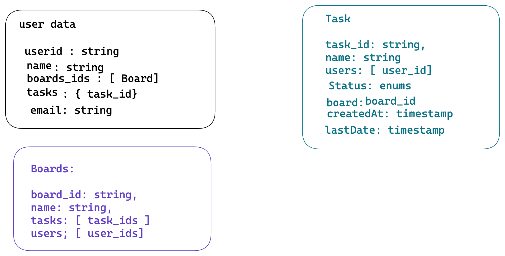

# AdvancedTodo Application

Application similar to jira clone 

Database: MongoDb

TODO: 

- [X]  Create user apis [Registration]
- [ ]  Support Social Registration [ google, github]
- [ ]  Support Social Login [google, github]
- [ ]  Update TODO
- [ ]  Websocket Implementation
- [ ]  RealTime Update
- [ ]  support editing at a same time

